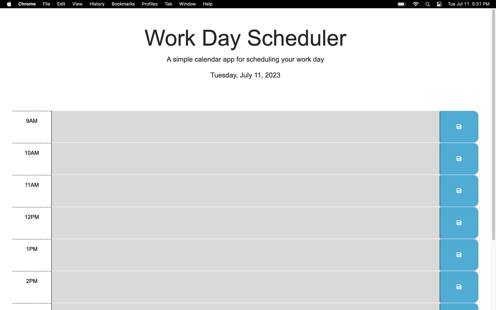

# Work Day Scheduler

## Technology Used 

| Technology Used         | Resource URL           | 
| ------------- |:-------------:| 
| HTML    | [https://developer.mozilla.org/en-US/docs/Web/HTML](https://developer.mozilla.org/en-US/docs/Web/HTML) | 
| CSS     | [https://developer.mozilla.org/en-US/docs/Web/CSS](https://developer.mozilla.org/en-US/docs/Web/CSS)      |   
| Git | [https://git-scm.com/](https://git-scm.com/)     |  
| Javascript | [https://developer.mozilla.org/en-US/docs/Web/JavaScript](https://developer.mozilla.org/en-US/docs/Web/JavaScript) |
| DayJS | [https://day.js.org/docs/en/display/display](https://day.js.org/docs/en/display/display)
| JQuery | [https://api.jquery.com/category/attributes/](https://api.jquery.com/category/attributes/)  

## Description 

[Visit the Deployed Site](https://github.io/jesustgr/work-day-scheduler)

To complete this task, I created a simple calendar application that allows a user to save events for each hour of a typical working day (9am–5pm). This app runs in the browser and features dynamically updated HTML and CSS powered by jQuery. It also uses the Day.js library to work with date and time. It is meant for an employee with a busy schedule to add important events to a daily planner so that they can manage their time effectively.


## Usage 

The screenshots below demonstrate the application's functionality.



When the user opens the planner, the current day is displayed at the top of the calendar


## Learning Points 


This is a good place to Explain what you Learned by creating this application.
This is a great way to remind about all of the Complex Skills you now have.
If the user is less experienced than you:
They will be impressed by what you can do!

If the user is more experienced than you:
They will be impressed by what you can do!

Remember, it is easy to forget exactly how Valuable and Impressive your skills are, as well as How Much You’ve Learned!
So quantify that here!


## Author Info

```md
### Farley Wittles 


* [Portfolio](https://youtu.be/bHX54GCrDB4)
* [LinkedIn](https://youtu.be/bHX54GCrDB4)
* [Github](https://youtu.be/bHX54GCrDB4)
```

The user has looked through your whole README, and gotten familiar with your application. 
This is where you take credit, and make it easy for them to learn more about you!
Direct them to the following:
- Your GitHub Profile
- Your LinkedIn
- Your Portfolio Website
- And Anything Else You Want!

Give credit where credit is due! 

If you Pseudocode or Pair Program with someone else, give them kudos in your Contributors section!


## Credits

List your collaborators, if any, with links to their GitHub profiles.

If you used any third-party assets that require attribution, list the creators with links to their primary web presence in this section.

If you followed tutorials, include links to those here as well.


## License

The last section of a good README is a license. This lets other developers know what they can and cannot do with your project. If you need help choosing a license, use [https://choosealicense.com/](https://choosealicense.com/)


---

🏆 The sections listed above are the minimum for a good README, but your project will ultimately determine the content of this document. You might also want to consider adding the following sections.

## Badges


Badges aren't _necessary_, per se, but they demonstrate street cred. Badges let other developers know that you know what you're doing. Check out the badges hosted by [shields.io](https://shields.io/). You may not understand what they all represent now, but you will in time.

## Features

If your project has a lot of features, consider adding a heading called "Features" and listing them there.

## Contributing

If you created an application or package and would like other developers to contribute it, you will want to add guidelines for how to do so. The [Contributor Covenant](https://www.contributor-covenant.org/) is an industry standard, but you can always write your own.

## Tests

Go the extra mile and write tests for your application. Then provide examples on how to run them.

---

© 2023 edX Boot Camps LLC. Confidential and Proprietary. All Rights Reserved.
